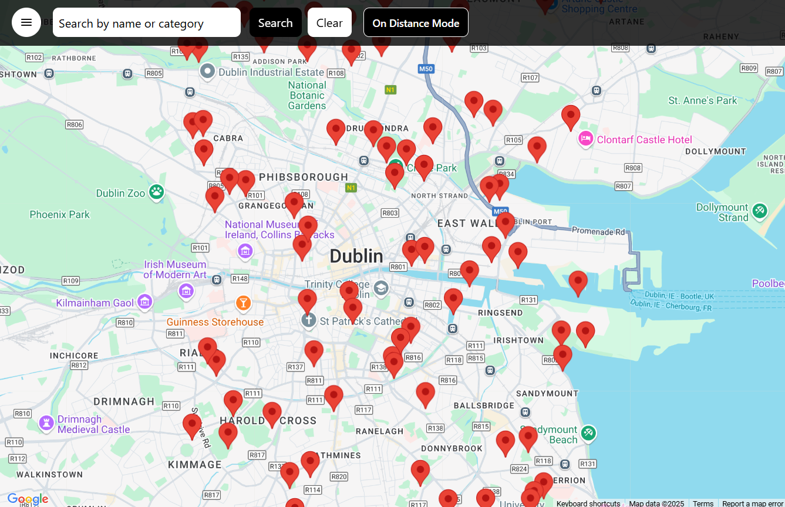
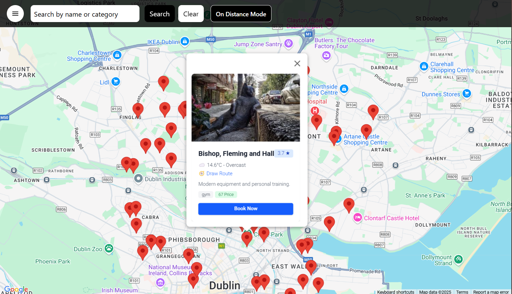
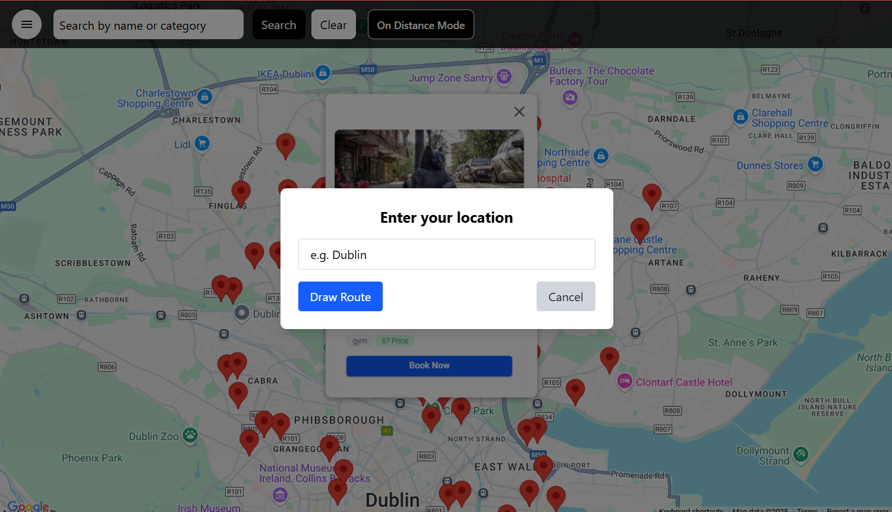
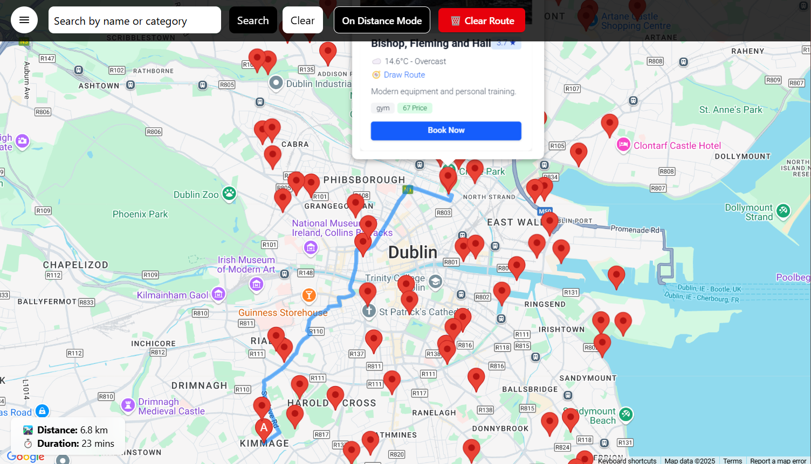
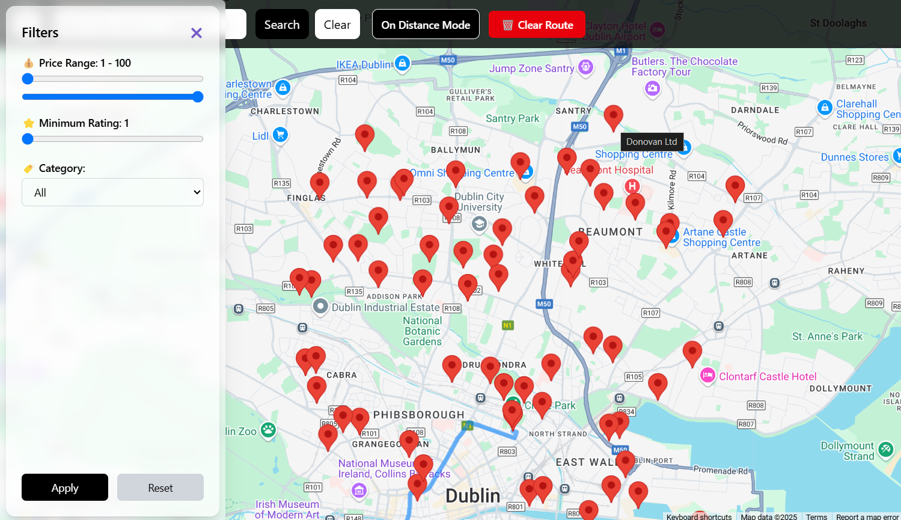
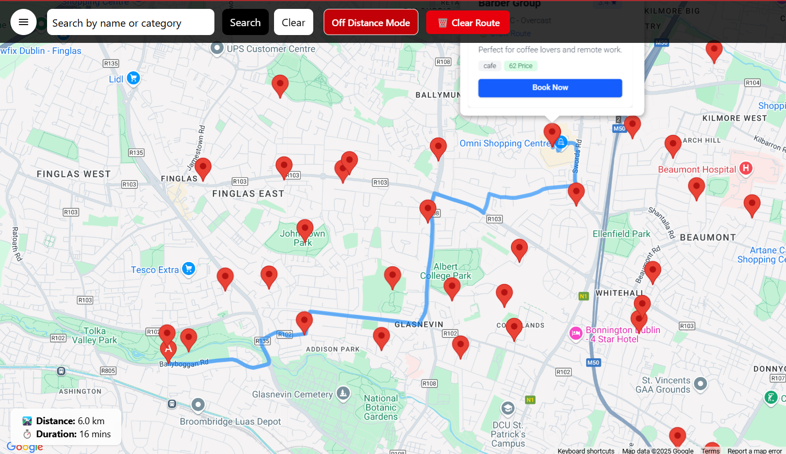

# 🗺️ Angular Google Maps Explorer

A responsive and interactive **Angular 19** web application using the **Google Maps JavaScript API**. Users can view, filter, and interact with a set of predefined locations loaded from a JSON file, view real-time weather for a place, and calculate distances between two points using an intuitive “Distance Mode”.

---

Explore the live demo: [Map App Demo uploaded on AWS S3 bucket](https://d17k8njvispv78.cloudfront.net/)

## 📦 Features

### ✅ Core Functionalities
- 📍 Displays interactive markers for places using `MapAdvancedMarker`.
- 🗂️ Dynamic filtering by **category**, **price**, **rating**, and **search**.
- 💬 Clicking a marker opens a custom-styled **info window** with:
  - Image, Name, Description, Rating, Category & Price
  - Real-time **weather information** via Open-Meteo API
  - "**🧭 Draw Route**" button to calculate distance
- 🧭 **Distance Mode**: Toggle to select any two markers and calculate the driving route between them using **Google Directions API**.
- 📏 Shows total distance and estimated duration.

### 🎨 UI & UX
- Fully **responsive** layout with mobile-first design using **Tailwind CSS**.
- Smooth toggle animations for filter panel and search bar.
- **Infowindow design** with consistent sizing and layout across screen sizes.
- Mobile search bar toggle for improved usability.

### 🚀 Performance & Optimization
- Uses **Angular Signals** and **computed properties** for reactive state management.
- Efficient loading of pre-rendered location data from local `assets/places.json`.
- Lazy loading of map directions and weather API only when needed.
- Optimized for responsiveness and performance.

---

## 🛠️ Tech Stack

- **Angular 19**
- **Google Maps JavaScript API**
- **@angular/google-maps** module
- **Tailwind CSS**
- **RxJS Signals**
- **Open-Meteo API** for weather
- **Modular Angular Architecture** (core, shared, features)

---

## ▶️ Getting Started

### 1. Clone the Repository

```bash
git clone https://github.com/your-username/google-maps-angular-app.git
cd google-maps-angular-app
```

### 2. Install Dependencies

```bash
npm install
```

### 3. Add API Keys

Make sure you have a valid **Google Maps API key**. Replace `YOUR_GOOGLE_MAPS_API_KEY` in `index.html`:

```ts
 (g=>{var h,a,k,p="The Google Maps JavaScript API",c="google",l="importLibrary",q="__ib__",m=document,b=window;b=b[c]||(b[c]={});var d=b.maps||(b.maps={}),r=new Set,e=new URLSearchParams,u=()=>h||(h=new Promise(async(f,n)=>{await (a=m.createElement("script"));e.set("libraries",[...r]+"");for(k in g)e.set(k.replace(/[A-Z]/g,t=>"_"+t[0].toLowerCase()),g[k]);e.set("callback",c+".maps."+q);a.src=`https://maps.${c}apis.com/maps/api/js?`+e;d[q]=f;a.onerror=()=>h=n(Error(p+" could not load."));a.nonce=m.querySelector("script[nonce]")?.nonce||"";m.head.append(a)}));d[l]?console.warn(p+" only loads once. Ignoring:",g):d[l]=(f,...n)=>r.add(f)&&u().then(()=>d[l](f,...n))})({
      v: "weekly",
      key: "YOUR_GOOGLE_MAPS_API_KEY"
    });
```

### 4. Run Locally

```bash
ng serve
```

Open your browser at [http://localhost:4200](http://localhost:4200)

---

## ✨ Enhancements & Extras

- ✅ Fully **standalone components** used with modern Angular.
- ✅ Use of **signals** for performant state tracking.
- ✅ **Modular app structure** (`core`, `shared`, `features`, `services`) for scalability.
- ✅ Filter drawer with smooth animation.
- ✅ Mobile-first UI — clean and intuitive on any device.
- ✅ Predefined **icons and weather integration** inside info windows.

---
## 📸 Screenshots

### 🏠 Home View


### 🧭 Info Window


### 📍 Distance From Your Location


### 🧭 Route from Your Location


### 🎛️ Filters Panel


### 📏 Two Marker Route Calculation


---

## 🤝 Contributing

Pull requests are welcome! For major changes, please open an issue first to discuss what you’d like to change.

---

## 📄 License

MIT © 2025 Alpeshkumar Dudhat

---